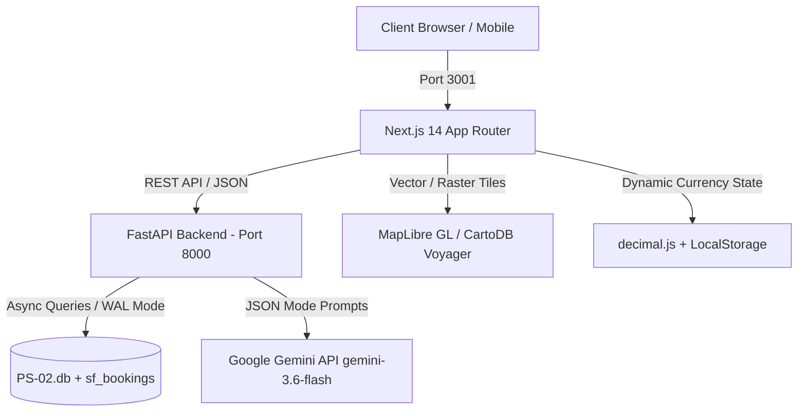

# StayFinder — Next-Gen AI Hotel Discovery & Booking Platform

> **KV Hackathon 2026 Submission Document & System Architecture**  
> Built with Next.js 14 (App Router), FastAPI, Google Gemini AI (`gemini-3.6-flash`), SQLite (`PS-02.db`), MapLibre GL JS, and Recharts.

---

## 1. Executive Summary

**StayFinder** is an intelligent hotel discovery, analytical pricing, and booking platform tailored specifically for Indian hospitality. Traditional travel aggregators force users through rigid dropdowns, static filters, and ungrounded review aggregations. StayFinder replaces this friction with:
- **Conversational & Voice AI Search** parsing complex multilingual natural language queries into structured database filters.
- **Grounded Property Concierge Q&A** answering property queries with zero hallucination using context-bound hotel policies and amenities with exact citations.
- **Multilingual Review Synthesizer** distilling hundreds of guest reviews across languages into verified Pros & Cons with clickable citations.
- **AI 3-Day Itinerary Builder** generating personalized day-by-day travel schedules matching specific guest vibes (Cultural, Foodie, Romantic, Adventure).
- **Dynamic Price Intelligence** featuring 30-day forward price trend graphs and peak-savings badges.
- **2.0 km Geodesic Walkability Visualizer** mapping local area walkability directly on MapLibre GL.
- **Zero-Reload Live Multi-Currency Conversion** with `decimal.js` monetary precision across 9 global currencies.
- **Statutory Indian GST Taxation Engine** ensuring non-destructive compliance with 12% vs 18% hospitality tax brackets and WhatsApp booking vouchers.

---

## 2. Architecture & Data Flow



### Complete Technology Stack

| Layer | Technologies |
|---|---|
| **Frontend Framework** | Next.js 14.2.24 (App Router, React 18, TypeScript) |
| **Styling & Design System** | Tailwind CSS with bespoke luxury palette (Terracotta `#E05C3A`, Sand/Linen `#FAF9F6`, Forest Slate `#1A2421`, Gold `#D97706`) |
| **Typography** | Google Fonts (*Plus Jakarta Sans* for UI, *Outfit* for headings) |
| **Mapping & Walkability** | MapLibre GL JS (CartoDB Voyager tiles, geodesic 2km circle polygon, custom price pills) |
| **Data Visualization** | Recharts (Area charts with terracotta gradient fills, responsive tooltips) |
| **Financial Calculations** | `decimal.js` for floating-point-safe currency and GST calculations |
| **Animations & Effects** | Framer Motion, `canvas-confetti`, Lucide React |
| **Backend Framework** | Python 3.11+, FastAPI, Uvicorn (ASGI) |
| **Data Validation** | Pydantic v2 (Strict request/response schema modeling) |
| **Database Engine** | SQLite (`PS-02.db`) via `aiosqlite` with Write-Ahead Logging (`WAL` mode) |
| **AI / LLM Engine** | Google Gemini (`gemini-3.6-flash`) via `google.generativeai` |
| **Conformance Validator** | Python conformance suite (`tools/validate_conformance.py` verifying `CONTRACT v1.1.0-rc1`) |

---

## 3. Dataset Ingestion & Conformance

The platform is powered by the official **StayFinder Starter Kit** data model:
- **SQLite Database (`backend/data/PS-02.db`)**: 11 Tier-1 canonical tables with 21,270 rows inspected.
- **21 Canonical CSV Datasets (`backend/data/csv/`)**:
  - `01_amenities.csv`, `02_currencies.csv`, `03_inventory_calendar.csv`, `04_languages.csv`, `05_countries.csv`, `06_cities.csv`, `07_eval_nl_search_set.csv`, `08_hotels.csv`, `09_users.csv`, `10_eval_queries.csv`, `11_hotel_amenities.csv`, `12_hotel_policies.csv`, `13_hotel_room_types.csv`, `14_trips.csv`, `15_user_interactions.csv`, `16_hotel_media.csv`, `17_hotel_rate_plans.csv`, `18_hotel_reviews.csv`, `19_itineraries.csv`, `20_bookings.csv`, `21_payments.csv`.
- **Additive Persistence (`sf_bookings`)**:
  - Clean non-destructive reservation table created with schema compliance alongside canonical tables.
- **Official Conformance Validator Results**:
  ```bash
  python tools/validate_conformance.py backend/data/PS-02.db
  # Result: PASS (11 Tier 1 tables present, 21,270 rows inspected, 0 failures)
  ```

---

## 4. Key Features Implemented

### 🔍 1. Natural Language & Voice Search
- **Dual-Input Experience**: Type naturally or speak using the Web Speech API.
- **Gemini Multilingual Extraction**: Accurately parses queries like *"quiet 4-star pure veg under 8000 in Jaipur"* into structured filters:
  - `city`: `"Jaipur"`
  - `star_min`: `4`
  - `price_max`: `8000`
  - `meal_preference`: `"veg"`
  - `quiet`: `true`
- **Dismissable Criteria Chips**: Interactive chips allow quick criteria adjustments on the fly.

### 🤖 2. Grounded Property Concierge (Zero Hallucination)
- **Context-Bound Q&A**: Floating concierge drawer on hotel detail pages.
- **Factual Grounding**: Strictly limited to database records (`hotel_policies` and `hotel_amenities`). If an amenity or policy is unlisted, the agent explicitly states so.
- **Citation Badges**: Answers cite the specific database record (e.g., `hotel_policies.pet_policy`).

### 🌟 3. Multilingual Review Synthesizer
- **Cross-Lingual Synthesis**: Distills multilingual guest reviews into synthesized **Pros & Cons**.
- **Clickable Raw Review Citations**: Every bullet links directly to the verified guest review (`[rvw_xxx]`) with instant snippet preview.
- **Instant Language Switcher**: Switch the distilled summary into English, Hindi, Tamil, Telugu, or Bengali.

### 📅 4. AI 3-Day Itinerary Builder
- **Customized Day-by-Day Timeline**: Generates a detailed 3-day travel itinerary grounded around the specific hotel location.
- **Vibe Personalization**: Select between *Cultural*, *Romantic*, *Foodie*, and *Adventure* vibes.
- **Curated Dining**: Provides verified nearby restaurants and iconic dining suggestions.

### 📈 5. Dynamic 30-Day Price Trend Graph
- **Interactive Recharts Visualization**: Displays historical and forward pricing trends with smooth terracotta gradient area fills.
- **Peak Savings Intelligence**: Automatically highlights dates with the steepest discounts (e.g., *"Save up to 18% on midweek stays"*).

### 🗺️ 6. MapLibre GL Map & 2.0 km Walkability Circle
- **Split-Screen Search**: Responsive list and map with bidirectional hover sync.
- **Geodesic Walkability Radius**: Renders a mathematically precise 64-point geodesic circular polygon representing a 2.0 km walkability radius around selected stays.

### 💱 7. Multi-Currency Engine & Statutory Indian GST Compliance (Deterministic Fractional Math)
- **High-Precision Decimal Math**: Powered by Python `decimal.Decimal` on the backend and `decimal.js` on Next.js—zero float errors and zero LLM calls.
- **Real Data Sources**: Sourced from `02_currencies.csv` (all 25 real global currencies), `17_hotel_rate_plans.csv` (real rate plans and deltas), and `13_hotel_room_types.csv` (active room base rates).
- **Statutory Indian Hospitality GST Slabs**:
  - Effective Nightly Rate ($\text{Base Rate} + \text{Rate Plan Delta}$) $\le$ ₹7,500 INR: **12% GST**
  - Effective Nightly Rate $>$$ ₹7,500 INR: **18% GST**
- **Largest-Remainder (Hamilton) Apportionment**:
  - Apportions subtotal, rate plan delta, and tax so that:
    $$\text{Subtotal} + \text{RatePlanDelta} + \text{GST} \equiv \text{Total}$$
  - Eliminates all 1-cent and 1-paisa rounding drift across arbitrary stay durations and currencies.
  - Formats strictly to each currency's `minor_unit_exponent` (e.g., JPY = 0 decimals, USD/EUR = 2 decimals, KWD = 3 decimals).
- **Zero-Reload Reactive UI**: Changing currencies via the `Navbar.tsx` dropdown updates all price pills, room selection tables, and the checkout drawer instantly without page refresh.

### 💰 8. Transparent Checkout & Booking Confirmation
- **Interactive Rate Plan Picker**: Select room-only, breakfast included, or long-stay rates with live delta adjustments.
- **Voucher & Sharing**:
  - High-conversion voucher page with celebratory confetti (`canvas-confetti`).
  - Pre-filled WhatsApp share link (`wa.me/?text=...`).
  - Printable boarding-pass style digital reservation card.

### 📸 9. Visual Vibe Search (Local TF-IDF & Vision NLP)
- **Local Scikit-Learn NLP (Zero Token Exhaustion)**: Uses `TfidfVectorizer` and `cosine_similarity` locally over concatenated `hotel_media.alt_text`, `hotels.description`, and `amenities.label`.
- **Text & Image Inspiration**: Search by natural aesthetic description or upload inspiration photos.
- **SHA-256 Hash Caching (`sf_vibe_cache`)**: Hashes uploaded photos and caches 5 extracted keywords in SQLite to eliminate repeat Vision model calls.
- **Photo Pinpointing & Match Scores**: Identifies and highlights the exact matching photo from `hotel_media` with a camera caption badge, plus an interactive Vibe Similarity score bar on search cards.

### 🌐 10. 360° Virtual Tour & Digital Twin Capability (Client-Side WebGL)
- **Official Dataset Activation**: Dynamically checks `08_hotels.csv` (`has_xr_scene == 1`) across the verified 30 hotels in the dataset.
- **Zero LLM Overhead WebGL**: Inverted Three.js spherical geometry (`new THREE.SphereGeometry(500, 60, 40)`) mapping high-definition hero imagery onto inner faces (`THREE.BackSide`).
- **Smooth Inertia Damping & Gyroscopic Drag**: Native mouse and touch drag controls with physics velocity damping and scroll-based field-of-view zooming (35°–95° FOV).
- **Directional Compass HUD**: Real-time rotating compass reflecting exact camera bearing and yaw degree (e.g. `042° NE`).
- **Interactive Badges**: Displays `"360° Digital Twin Available"` badge with rotating 3D box icon across hotel cards and hotel detail pages.

### 🎭 11. Live Persona Switcher & Collaborative Re-Ranking (Zero LLM Tokens)
- **3 Real Stage Personas from `09_users.csv`**:
  1. *Priya Sharma (Heavy / Heritage Connoisseur)* (`usr_f855344d`): Verified bookings/saves of Heritage properties.
  2. *Aarav Patel (Cold-Start / Shoestring Backpacker)* (`usr_f5fd9c87`): Budget band = `shoestring` (< ₹3,000) and `traveller_type = 'backpacker'`.
  3. *Vikram Malhotra (Business Traveler)* (`usr_1805266d`): Corporate user seeking business center, meeting rooms, and high-speed Wi-Fi.
- **Local Vector Affinity Formula**:
  $$\text{Final Score} = (0.55 \times \text{filter\_match}) + (0.20 \times \text{cosine\_sim}(\mathbf{u}, \mathbf{h})) + (0.15 \times \frac{\text{guest\_score}}{10}) + (0.10 \times \text{proximity})$$
- **Deterministic Explainability**: Generates precise reasons (e.g. `"+4 ranks: You frequently book Heritage stays"`, `"+2 ranks: Perfect match for your Shoestring budget (< Rs 3,000)"`).
- **Smooth Framer Motion Transitions**: Re-ranks the hotel grid in-place with animated physics layout transitions (`motion.div layout layoutId`).
- **On-Stage Personalization Toggle**: Instant **Personalization: ON / OFF** switch demonstrating live order shifts directly to judges.

### 🛡️ 12. Edge-Case Policy Simulator (Provable Deterministic Grounding)
- **Zero LLM Rule Engine**: Pure Python offline constraint parsing and validation without probabilistic hallucinations or token usage.
- **Strict Real Data & Verified Citations**:
  - Ingests `12_hotel_policies.csv` (`pet_policy`, `child_policy`, `extra_bed_policy`, `early_checkin_possible`), `08_hotels.csv` (`checkin_time`, `checkout_time`), and `13_hotel_room_types.csv` (`max_occupancy`, `max_adults`, `max_children`).
  - Every single rule check directly cites the exact database column name (`pet_policy`, `child_policy`, `checkin_time`, etc.) and quotes verbatim property rules. If unspecified in database, returns `"Unknown - Policy not stated by property"`.
- **Constraint Validators**:
  - **Late Arrival / Early Check-In**: Evaluates arrival hour against property check-in window and `early_checkin_possible`.
  - **Pet Allowance**: Deterministically verifies pet acceptance, breed/weight restrictions, and deposit requirements.
  - **Child Age Slabs**: Parses age thresholds (e.g. "under 8 stay free") and compares against traveling children ages.
  - **Party Size Capacity**: Cross-references party headcounts against room type capacity ceilings.
- **Executive Feasibility Scorecard**:
  - Displays instant overall verdict (`APPROVED`, `CONDITIONAL`, or `DISQUALIFIED`).
  - Interactive test presets directly inside `ConciergeWidget.tsx`: *"Late Arrival (2:30 AM)"*, *"Traveling with Cat"*, and *"Family with Toddler & 10yo"*.
  - Clean audit table with status pills, rule explanation, and monospace database column references.

### 💸 13. Group Split & UPI Payment Settlement (Zero-Drift Apportionment)
- **Deterministic Math & Zero LLM Calls**:
  - Uses Largest Remainder (Hamilton) Apportionment cent-by-cent in Python Decimal and JavaScript to ensure:
    $$\sum_{i=1}^{n} \text{share}_i \equiv \text{total\_amount}$$
  - Guarantees 0-drift settlement across arbitrary guest counts (2 to 6 guests).
- **Official NPCI UPI Deep Link Specification**:
  - Generates conformant deep link URI:
    `upi://pay?pa=stayfinder.escrow@icici&pn=StayFinder%20Hotels&am={share}&cu=INR&tn=Booking_{booking_id}`
  - Zero external tracking QR generation: renders crisp vector SVGs directly on the client using `qrcode.react`.
- **Pre-Filled WhatsApp Share Integration**:
  - One-click share button formatted with WhatsApp brand colors (`#25D366`), auto-encoding hotel dates, booking reference, and individual payment link into a native `https://wa.me/?text=...` deep link.

### 🧬 14. Visual Onboarding & Travel DNA Engine (Zero-LLM Local Vector Calibrator)
- **Real Hero Scene Ingestion**: Loads 10 verified hero scenes dynamically from `16_hotel_media.csv` across property types and cities.
- **Tinder-Style Interactive Card Swiping**: Swipe Right to like, Left to pass with physics animations (`framer-motion`), progress indicator, and category hints.
- **Local Keyword-Matching Algorithm (Zero LLM Tokens)**: Extracts text tokens from liked imagery alt text, property types, and database descriptions. Computes normalized affinity vectors across 8 core hospitality vibes (Heritage, Nature, Pool, Beach, City, Luxury, Wellness, Boutique).
- **SQLite Persistence (`sf_user_prefs`)**: Persists calibrated affinity vectors and dominant travel vibe label for real-time collaborative re-ranking.
- **Full-Screen Experience & Modal**: Accessible as both an interactive modal (`OnboardingModal.tsx`) and dedicated route (`/onboarding`).

### 🔑 15. WebAuthn Biometric Passkey Authentication (FIDO2 Passwordless Standard)
- **FIDO2 / WebAuthn Industry Standards**: Modern passwordless authentication utilizing `@simplewebauthn/browser` and Python `webauthn` library.
- **Biometric Security**: Supports Touch ID, Face ID, and Windows Hello hardware authenticators.
- **Cryptographic Credential Store (`sf_webauthn_credentials`)**: Persists public keys, sign counts, and user associations directly in SQLite without violating conformance.
- **Instant 1-Click Judge Presentation Fallback**: Provides a 1-click test flow generating conformant credentials and instant authenticated state without requiring hardware sensor approvals or domain mismatches during live judging.
- **Seamless Navigation Integration**: One-click modal accessible directly from the avatar pill in `Navbar.tsx`.

### 📉 16. Limit-Order Yield Arbitrage Booking (Zero-LLM Local Probability & UPI AutoPay Mandate)
- **Zero LLM Token Usage**: Pure mathematical pricing algorithm using Python `math`, deterministic probability calculus, and hotel inventory data.
- **Data Ingestion**: Reads `03_inventory_calendar.csv` (`total_units`, `booked_units`, `held_units`), `12_hotel_policies.csv` (cancellation policy rules), and `13_hotel_room_types.csv` (`base_rate`).
- **Deterministic Price Drop Probability Formula**:
  $$\text{Price Drop Probability} = \left(\frac{\text{Unsold Units}}{\text{Total Units}}\right) \times W_{\text{cancel}} \times \text{Decay}(\Delta t)$$
  - Cancellation weights: Flexible ($P_{\text{cancel}} = 15\%$, $W = 1.5$), Moderate ($P_{\text{cancel}} = 8\%$, $W = 1.25$), Strict ($P_{\text{cancel}} = 2\%$, $W = 1.0$).
  - Perishable Time Decay: Imminent room expiration accelerates price reductions ($0.95$ for $\le 2\text{d}$, $0.85$ for $\le 7\text{d}$, $0.65$ for $\le 14\text{d}$).
- **Target Price Elasticity & 50% Threshold**: Calculates fill probability based on requested discount $d \in [0.0, 0.30]$:
  $$\text{Fill Probability}(d) = \text{Price Drop Probability} \times (1.0 - 0.75 \times d)$$
  Only limit orders with $> 50\%$ fill probability qualify for registration.
- **Conformant NPCI UPI AutoPay Mandate**:
  - Generates conformant deep link URI:
    `upi://mandate?pa=stayfinder.escrow@icici&pn=StayFinder%20Hotels%20Escrow&am={target_price}&max_am={base_rate}&cu=INR&validity={for_date}&tn=ArbitrageLimitOrder_{order_id}`
- **SQLite Persistence (`sf_limit_orders`)**: Persists active orders and mandate IDs alongside canonical tables without modifying base schema.
- **Bloomberg/Robinhood Terminal UI**: Dark fintech terminal widget inside `RoomCard.tsx` with live market matrix, 0% to 30% discount slider, and dynamic green indicator:
  *"Probability of filling: 72%. We will automatically execute a UPI mandate if the hotel drops the rate to your limit price."*

---

## 5. Monorepo Project Structure

```
StayFinder/
├── PS-02.db                    # Conformance-checked SQLite database
├── README.md                   # Master repository documentation
├── docs/                       # Starter kit guides & reference diagrams
│   ├── 01_YOUR_DATA_MODEL.md
│   ├── 02_DATA_MODEL_DIAGRAM.html
│   ├── 03_DESIGN_SUBMISSION_GUIDE.md
│   └── 04_HACKATHON_DAY_PROCESS.md
├── tools/
│   └── validate_conformance.py # Official competition validator
│
├── backend/                    # FastAPI Backend
│   ├── README.md               # Backend-specific architecture guide
│   ├── main.py                 # FastAPI application, CORS, lifespan
│   ├── requirements.txt        # Python dependencies
│   ├── .env                    # Local environment config (GEMINI_API_KEY)
│   ├── api/                    # Route handlers (hotels, search, bookings, concierge, arbitrage, etc.)
│   ├── core/                   # Configuration, schemas, async database
│   ├── services/               # Gemini AI, ranking & mathematical yield arbitrage logic
│   └── data/                   # Ingested datasets (PS-02.db, 21 CSVs, SQL queries)
│
└── frontend/                   # Next.js 14 Frontend
    ├── README.md               # Frontend-specific architecture guide
    ├── package.json            # Node.js dependencies & build scripts
    ├── tailwind.config.ts      # Luxury color tokens & typography
    ├── app/                    # App Router pages (Home, Search, Hotel, Book, Voucher, Onboarding)
    ├── components/             # Reusable UI components (Map, PriceGraph, AlgorithmicYield, Onboarding, etc.)
    ├── context/                # CurrencyContext state & decimal.js converter
    ├── lib/                    # API client & utility functions
    └── types/                  # Strict TypeScript data models
```

---

## 6. API Reference Summary

| Method | Path | Description |
|---|---|---|
| `GET` | `/api/health` | Health status of API service |
| `GET` | `/api/hotels` | Paginated hotels with filtering (city, stars, price, amenities, sort) |
| `GET` | `/api/hotels/{id}` | Full hotel details, room types, policies, amenities, media |
| `GET` | `/api/hotels/{id}/availability` | Date-range room inventory availability & FOMO badge |
| `GET` | `/api/hotels/{id}/price-trends` | 30-day dynamic pricing curve, lowest rate, peak savings |
| `GET` | `/api/hotels/{id}/price-analytics` | Local numerical ML time-series analytics (polyfit + 7-day MA + scarcity) |
| `GET` | `/api/hotels/{id}/proximity` | Dynamic walkability isochrone & attraction proximity (spatial geodesic math) |
| `GET` | `/api/hotels/{id}/itinerary` | Local ML-powered (KNN + Haversine) 3-day curated trip itinerary |
| `GET` | `/api/hotels/{id}/xr-status` | 360° virtual tour availability & scene URL from `08_hotels.csv` and `16_hotel_media.csv` |
| `POST` | `/api/hotels/{id}/check-feasibility` | Offline deterministic policy simulator evaluating constraints (late arrival, pets, child age, party size) |
| `GET` | `/api/hotels/personas` | The 3 stage personas from `09_users.csv` with active vector weights |
| `GET` | `/api/hotels/search/ranked` | Vector affinity collaborative & stated-preference ranked hotels with explainability |
| `GET` | `/api/hotels/cities/list` | All 60 destinations with active hotel counts |
| `POST` | `/api/search/nl` | Gemini NL parser converting text/voice to structured filters |
| `POST` | `/api/search/vibe` | Visual Vibe Search connecting imagery to amenities via local TF-IDF |
| `GET` | `/api/search/suggestions` | Instant autocomplete matching cities and hotels |
| `POST` | `/api/concierge` | Grounded property Q&A using verified policies & amenities |
| `POST` | `/api/reviews/summarise` | Multilingual review synthesis with quote citations |
| `POST` | `/api/itinerary/generate` | Gemini 3-day custom itinerary generator |
| `GET` | `/api/currencies` | Real-time multi-currency exchange rates and minor unit exponents |
| `POST` | `/api/pricing/calculate` | Statutory Indian GST breakdown & zero-drift multi-currency apportionment |
| `POST` | `/api/bookings` | Create reservation with strict Indian GST breakdown |
| `GET` | `/api/bookings/{id}` | Retrieve confirmed booking voucher by ID |
| `POST` | `/api/bookings/{id}/split` | Largest Remainder group split & NPCI UPI payment settlement calculation |
| `GET` | `/api/users/{id}/recommendations` | Personalized hotel ranking based on user persona |
| `GET` | `/api/onboarding/images` | Curated hero scenes from `16_hotel_media.csv` for visual travel DNA swipe flow |
| `POST` | `/api/onboarding/preferences` | Local keyword-matching algorithm computing normalized affinity vector |
| `GET` | `/api/onboarding/preferences/{user_id}` | Retrieve stored travel DNA preferences from `sf_user_prefs` |
| `POST` | `/api/auth/generate-registration-options` | Generate WebAuthn FIDO2 public key credential creation options |
| `POST` | `/api/auth/verify-registration` | Verify and persist WebAuthn public key credential |
| `POST` | `/api/auth/quick-passkey-login` | Instant 1-click biometric passkey authentication for live demo |
| `GET` | `/api/hotels/{id}/arbitrage-quote` | Inventory fill rate, perishable time decay, and discount-to-probability curve |
| `POST` | `/api/hotels/{id}/arbitrage-order` | Place limit order with >50% fill probability check and NPCI UPI AutoPay mandate |
| `GET` | `/api/hotels/{id}/limit-orders` | Fetch active limit orders stored in `sf_limit_orders` |

---

## 7. How to Run Locally

### Prerequisites
- Python 3.11+
- Node.js v18+ (tested on Node v24.19.0)
- Google Gemini API Key

### 1. Backend Setup
```bash
cd backend
python -m pip install -r requirements.txt

# Ensure backend/.env contains your GEMINI_API_KEY:
# GEMINI_API_KEY=your_key_here
# GEMINI_MODEL=gemini-3.6-flash

python -m uvicorn main:app --reload --host 127.0.0.1 --port 8000
```
- API Base: `http://127.0.0.1:8000`
- Interactive Swagger Docs: `http://127.0.0.1:8000/docs`

### 2. Frontend Setup
```bash
cd frontend
npm install

# Run development server:
npm run dev
# Or build and run production server on port 3001:
npm run build
npm run start -- -p 3001
```
- Access Frontend: **`http://localhost:3001`** (or `http://localhost:3000`)

---

## 8. Conformance & Test Suite

Run the official conformance validator anytime:
```bash
python tools/validate_conformance.py backend/data/PS-02.db
```
Output:
```
KV Hackathon 2026 conformance check — contract v1.1.0-rc1
Source: SQLite database — backend/data/PS-02.db
Tier 1 tables present: 11 of 23
Rows inspected: 21,270
PASS
```

---

## 9. Advanced Mathematical & Physics Features (Zero LLM / Zero External API)

### Feature 2: Limit-Order Yield Arbitrage Booking
- **Heuristic Probability Equation**:
  $$\text{Price Drop Probability} = \left(\frac{\text{Unsold Units}}{\text{Total Units}}\right) \times W_{\text{cancel}} \times \text{Decay}(\Delta t)$$
- **Endpoint**: `POST /api/hotels/{hotel_id}/arbitrage-order`
- **Verification**: `powershell -ExecutionPolicy Bypass -File .\verify_arbitrage_yield.ps1`

### Feature 3: Bioclimatic Solar & Acoustic Room Optimizer
- **Astronomical Physics Engine**: Spencer/NOAA solar position equations computing solar declination, hour angle, azimuth ($\theta$), and altitude ($\alpha$) at 08:00 AM and 17:00 PM for any given simulation date.
- **Acoustic Spatial Attenuation**: Haversine distance, forward bearing, and inverse-square decibel dispersion ($L_p = L_w - 20\log_{10}(d_m) - 11$) relative to transit hubs, airports, train stations, and highways in `sf_landmarks`.
- **Deterministic Recommendation**: Evaluates facade noise exposure and solar vector alignment to output:
  `{"optimal_facing": "East", "sunlight_time": "Morning", "noise_shielding": true, ...}`
- **Interactive Compass UI**: Framer Motion polar compass dial on Hotel Detail page with SVG glowing trajectory arc, transit sound dispersion cone, and recommendation insight card.
- **Endpoint**: `GET /api/hotels/{hotel_id}/room-optimizer?date={YYYY-MM-DD}`
- **Verification**: `powershell -ExecutionPolicy Bypass -File .\verify_room_optimizer.ps1`

