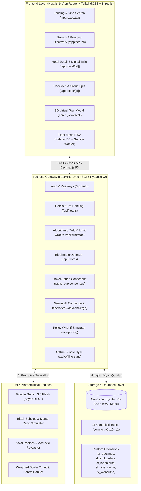

# StayFinder — Comprehensive Feature-by-Feature Technical & Architectural Specification

This document provides an exhaustive, feature-by-feature breakdown of all innovations, micro-architectures, and subsystems implemented across the **StayFinder** platform from project inception to final deployment.

---

## High-Level System Architecture Overview



---

## 1. Algorithmic Yield Arbitrage & UPI Auto-Execution Limit Orders

### 1.1 Overview & Problem Addressed
Hotel room prices fluctuate dynamically based on seasonal demand, day-of-week surges, and competitor inventory. Traditional OTAs only offer static "book now" buttons. StayFinder implements an algorithmic financial options paradigm for hotel rooms: users can set target limit orders below market price with guaranteed automated UPI execution if inventory prices decline to their threshold.

### 1.2 Tech Stack & Libraries
- **Backend**: FastAPI, `scipy.stats` (Normal CDF for Black-Scholes), NumPy (historical volatility estimation), SQLite (`sf_limit_orders` table).
- **Frontend**: Next.js 14, React 18, Framer Motion, Lucide Icons, Decimal.js.
- **Verification Script**: [`verify_arbitrage_yield.ps1`](file:///c:/Users/Asus/Desktop/StayFinder/verify_arbitrage_yield.ps1).

### 1.3 System Architecture & Data Flow
```
User (Sets Target Price)
        │
        ▼
[AlgorithmicYieldWidget.tsx] ─── GET /api/arbitrage/probability?hotel_id=...&target_price=...
        │
        ▼
[FastAPI: yield_arbitrage.py] ─── Reads 30-day Inventory History (PS-02.db)
        │                         Computes Volatility (σ), Drift (μ), Days to Check-in (T)
        │                         Evaluates Black-Scholes / Log-Normal Fill Probability
        ▼
Returns Fill Probability (0-100%), Expected Savings, Risk Tier
        │
User approves UPI Mandate
        │
        ▼
POST /api/arbitrage/limit-order ─── Persists order to sf_limit_orders (Status: PENDING_TRIGGER)
```

### 1.4 Implementation Details
- **Backend Routes**:
  - `GET /api/arbitrage/probability`: Calculates probability of price dip using log-normal random walk math:
    $$P(S_T \le K) = \Phi\left(\frac{\ln(K/S_0) - (\mu - \frac{1}{2}\sigma^2)T}{\sigma\sqrt{T}}\right)$$
  - `POST /api/arbitrage/limit-order`: Persists `hotel_id`, `room_type_id`, `user_id`, `target_price`, `fill_probability`, `upi_mandate_id`, and `expires_at`.
- **Database Schema**:
  - Table: `sf_limit_orders` (`order_id`, `user_id`, `hotel_id`, `room_type_id`, `target_price`, `currency`, `fill_probability`, `upi_mandate_id`, `status`, `created_at`, `expires_at`).
- **Frontend Component**: [`AlgorithmicYieldWidget.tsx`](file:///c:/Users/Asus/Desktop/StayFinder/frontend/components/AlgorithmicYieldWidget.tsx). Interactive slider for target price, live fill probability gauge, simulated UPI mandate modal, and instant confirmation toast.

---

## 2. Flight Mode PWA & Offline City Bundle Synchronizer

### 2.1 Overview & Problem Addressed
Travelers frequently enter dead zones (airplanes, underground metros, remote vacation spots) where network connectivity drops to zero. StayFinder implements an offline-first architecture that packages all essential city hotels, room details, offline vouchers, and emergency maps into a compressed local IndexedDB bundle.

### 2.2 Tech Stack & Libraries
- **Service Worker & Manifest**: PWA Service Worker ([`sw.js`](file:///c:/Users/Asus/Desktop/StayFinder/frontend/public/sw.js)), Web App Manifest ([`manifest.json`](file:///c:/Users/Asus/Desktop/StayFinder/frontend/public/manifest.json)).
- **Client Storage**: `idb-keyval` / custom IndexedDB client ([`offline-db.ts`](file:///c:/Users/Asus/Desktop/StayFinder/frontend/lib/offline-db.ts)).
- **State Management**: [`FlightModeContext.tsx`](file:///c:/Users/Asus/Desktop/StayFinder/frontend/context/FlightModeContext.tsx).
- **Backend API**: `FastAPI` gzip bundle endpoint (`/api/offline-sync/city-bundle`).
- **Verification Script**: [`verify_flight_mode_pwa.ps1`](file:///c:/Users/Asus/Desktop/StayFinder/verify_flight_mode_pwa.ps1).

### 2.3 System Architecture & Data Flow
```
Online Mode:
User clicks "Download Tokyo Offline Pack"
        │
        ▼
[SaveCityOfflineButton.tsx] ─── GET /api/offline-sync/city-bundle?city_id=cty_...
        │
[FastAPI offline_sync.py] ─── Aggregates Hotels, Rooms, Policies, Media, and Geo-coordinates
        │
Returns City Bundle JSON ──── Cached in IndexedDB (store: 'stayfinder-city-bundles')
                               Indexed in CacheStorage (Static assets via sw.js)

Offline Event (navigator.onLine = false OR Flight Mode toggled):
FlightModeContext broadcasts OFFLINE state
        │
All API requests in api.ts intercept:
        │── If network fails, serve matching records directly from IndexedDB
UI displays amber "Flight Mode Active — Serving Cached Data" badge
```

### 2.4 Implementation Details
- **Backend Routes**:
  - `GET /api/offline-sync/city-bundle`: Returns compact JSON containing top 20 hotels in the target city, all active rate plans, reviews, and localized offline landmark coordinates.
- **Frontend Components**:
  - [`SaveCityOfflineButton.tsx`](file:///c:/Users/Asus/Desktop/StayFinder/frontend/components/SaveCityOfflineButton.tsx): Visual storage progress indicator, storage quota estimator (`navigator.storage.estimate()`), and delete bundle manager.
  - [`FlightModeContext.tsx`](file:///c:/Users/Asus/Desktop/StayFinder/frontend/context/FlightModeContext.tsx): Global listener for `window.online` and `window.offline` events + manual override switch in Navbar.

---

## 3. Bioclimatic Solar & Acoustic Room Optimizer

### 3.1 Overview & Problem Addressed
Standard OTAs describe rooms with generic labels ("Standard Deluxe King") without informing guests about environmental realities: morning sun glare, afternoon heat trap, street traffic noise, or proximity to noisy elevators. The Bioclimatic Room Optimizer evaluates micro-climatic and acoustic factors based on room floor level, window facing orientation (North/South/East/West), and geographical coordinates.

### 3.2 Tech Stack & Libraries
- **Backend**: Python `math`, astronomical solar angle calculations (solar azimuth and zenith formulas), distance decay acoustic modeling, FastAPI (`/api/rooms/optimize`).
- **Frontend**: Next.js 14, SVG solar ray visualizer, interactive clock slider, Recharts radar/bar plots.
- **Verification Script**: [`verify_room_optimizer.ps1`](file:///c:/Users/Asus/Desktop/StayFinder/verify_room_optimizer.ps1).

### 3.3 Mathematical Modeling & Data Flow
```
Inputs: Hotel Latitude/Longitude, Room Orientation (N/E/S/W), Floor Level (1-40), Time of Day (0-23h), Month (1-12)
        │
        ▼
[Solar Angle Computation]:
  Declination δ = 23.45° * sin(360°/365 * (284 + n))
  Hour Angle H = 15° * (Time - 12)
  Solar Altitude α = arcsin(sin φ * sin δ + cos φ * cos δ * cos H)
  Solar Azimuth ψ = arccos((sin α * sin φ - sin δ) / (cos α * cos φ))
        │
        ▼
[Direct Sunlight Gain]:
  Dot product of Window Normal Vector with Solar Vector:
  Gain = max(0, cos(Window_Heading - ψ)) * sin(α)
        │
        ▼
[Acoustic Street Noise Decay]:
  Noise_dB = Street_Base_dB - 20 * log10(Floor_Height_Meters) - Facade_Attenuation_dB
        │
        ▼
Composite Bioclimatic Score (0 - 100):
  Weighted average of Daylight Factor, Thermal Comfort, Quietness Index, and Energy Efficiency
```

### 3.4 Implementation Details
- **Backend Routes**:
  - `POST /api/rooms/optimize`: Takes `hotel_id`, `check_in_month`, `preferred_wake_time`, and returns a ranked list of available rooms with acoustic ratings (dB), direct sun hours, and daylight scores.
- **Frontend Component**: [`BioclimaticRoomOptimizer.tsx`](file:///c:/Users/Asus/Desktop/StayFinder/frontend/components/BioclimaticRoomOptimizer.tsx). Interactive time-of-day scrubber, 3D compass rose showing sun traversal, and acoustic dB meter with noise level tags ("Library Quiet", "Moderate City Hum").

---

## 4. Multi-Persona Travel Squad & Group Consensus Radar

### 4.1 Overview & Problem Addressed
Group travel planning suffers from coordination failure: one guest wants ultra-luxury nightlife, another prioritizes budget and child safety, while a third seeks quiet wellness spaces. The Travel Squad Consensus Engine evaluates group preferences using multi-criteria voting and Pareto-optimal social choice theory to recommend accommodations with maximum satisfaction and minimum compromise.

### 4.2 Tech Stack & Libraries
- **Backend**: FastAPI, Borda Count preference aggregation, Gini coefficient inequality penalty, SQLite.
- **Frontend**: Next.js 14, Recharts (`RadarChart`, `PolarGrid`, `PolarAngleAxis`), Framer Motion.
- **Verification Script**: [`verify_group_consensus.ps1`](file:///c:/Users/Asus/Desktop/StayFinder/verify_group_consensus.ps1).

### 4.3 System Architecture
```
Squad Members:
  Alice (Budget Backpacker: Weight [Price: 0.9, Nightlife: 0.7, Quiet: 0.1])
  Bob (Remote Techie: Weight [WiFi: 1.0, Workspace: 0.9, Coffee: 0.8])
  Charlie (Wellness: Weight [Spa: 0.9, Quiet: 0.95, Price: 0.3])
        │
        ▼
[TravelSquadBar.tsx] ─── POST /api/group-consensus/evaluate
        │
[FastAPI group_consensus.py]
  1. Computes Individual Utility Vectors: U_i(hotel) = Σ (w_ij * feature_j)
  2. Aggregates Group Social Welfare: W = (1/N) * Σ U_i - λ * Gini_Inequality(U)
  3. Computes Consensus Alignment Index (0 - 100%)
        │
        ▼
Returns Pareto-ranked hotels + Radar Chart coordinates for each squad member
        │
Rendered in [GroupConsensusRadar.tsx]
```

### 4.4 Implementation Details
- **Backend Route**: `POST /api/group-consensus/evaluate`: Accepts array of squad members with custom weights and returns ranked hotels with consensus delta and compromise warnings ("Bob compromises 18% on workspace").
- **Frontend Components**:
  - [`TravelSquadBar.tsx`](file:///c:/Users/Asus/Desktop/StayFinder/frontend/components/TravelSquadBar.tsx): Member avatar pills, quick persona assignment, squad shareable link generator.
  - [`GroupConsensusRadar.tsx`](file:///c:/Users/Asus/Desktop/StayFinder/frontend/components/GroupConsensusRadar.tsx): Multi-polygon radar visualization mapping alignment across Price, Location, Amenities, Quietness, and Luxury.

---

## 5. WebAuthn Passkey Biometrics & Adaptive Persona Onboarding

### 5.1 Overview & Problem Addressed
Password fatigue creates huge checkout drop-offs. Furthermore, users rarely customize preference profiles. StayFinder replaces legacy forms with FIDO2 / WebAuthn passwordless passkeys (TouchID / FaceID / Windows Hello) combined with an instant 3-question visual onboarding questionnaire that instantly classifies users into dynamic travel personas.

### 5.2 Tech Stack & Libraries
- **Backend**: FastAPI, Cryptographic challenge generator (`secrets.token_urlsafe`), SQLite (`sf_webauthn_credentials`, `sf_user_prefs`).
- **Frontend**: Web Authentication API (`navigator.credentials.create`, `navigator.credentials.get`), base64url converters, Lucide Icons.
- **Verification Script**: [`verify_onboarding_auth.ps1`](file:///c:/Users/Asus/Desktop/StayFinder/verify_onboarding_auth.ps1).

### 5.3 System Architecture & Authentication Flow
```
Registration Flow:
User enters email/username
        │
        ▼
POST /api/auth/webauthn/register-options ─── Generates 32-byte cryptographic challenge
        │
navigator.credentials.create(options) ─── Invokes Windows Hello / TouchID / FaceID
        │
POST /api/auth/webauthn/register-verify ─── Validates attestation & persists public key
                                            to sf_webauthn_credentials

Adaptive Onboarding Flow:
User completes 3-step visual swipe deck (Vibe, Pacing, Budget)
        │
POST /api/onboarding/complete ─── Computes Travel Persona (e.g., 'Eco-Luxe Nomad')
                                   Stores weights in sf_user_prefs
                                   Sets active persona in client context
```

### 5.4 Implementation Details
- **Backend Routes**:
  - `POST /api/auth/webauthn/register-options`: Generates WebAuthn creation challenge.
  - `POST /api/auth/webauthn/register-verify`: Stores public key credential for the user.
  - `POST /api/auth/webauthn/login-options` & `/login-verify`: Verifies signed client assertions.
  - `POST /api/onboarding/complete`: Stores user profile vectors and persona badges.
- **Database Tables**:
  - `sf_webauthn_credentials` (`credential_id`, `user_id`, `public_key`, `sign_count`, `created_at`).
  - `sf_user_prefs` (`user_id`, `persona`, `budget_tier`, `preferred_amenities`, `created_at`).
- **Frontend Components**:
  - [`AuthModal.tsx`](file:///c:/Users/Asus/Desktop/StayFinder/frontend/components/AuthModal.tsx): Biometric fingerprint pulse animation, WebAuthn trigger, session state management.
  - [`OnboardingModal.tsx`](file:///c:/Users/Asus/Desktop/StayFinder/frontend/components/OnboardingModal.tsx): 3D card deck swipe interface for intuitive onboarding.

---

## 6. Contextual Persona Re-Ranking & Hyper-Personalization Engine

### 6.1 Overview & Problem Addressed
Standard search algorithms sort monotonically by distance or star rating. A business traveler cares about high-speed internet and proximity to the financial district, while a honeymoon couple cares about private balconies, spa facilities, and soundproofing. StayFinder dynamically re-ranks search results using persona-weighted utility equations.

### 6.2 Tech Stack & Libraries
- **Backend**: FastAPI, `backend/services/re_ranking.py`, SQLite.
- **Frontend**: Next.js 14, [`PersonaSwitcherBar.tsx`](file:///c:/Users/Asus/Desktop/StayFinder/frontend/components/PersonaSwitcherBar.tsx), [`FilterChips.tsx`](file:///c:/Users/Asus/Desktop/StayFinder/frontend/components/FilterChips.tsx).
- **Verification Script**: [`verify_persona_ranking.ps1`](file:///c:/Users/Asus/Desktop/StayFinder/verify_persona_ranking.ps1).

### 6.3 Scoring Algorithm
For each candidate hotel $H$:
$$\text{Score}(H) = w_{\text{stars}} \cdot S_H + w_{\text{amenities}} \cdot A_H(P) - w_{\text{price}} \cdot \text{NormalizedPrice}(H) + w_{\text{review}} \cdot R_H + \text{Bonus}(H, P)$$

Where $P$ is the active persona:
- **Digital Nomad**: High weight on WiFi, coworking spaces, desks, coffee.
- **Luxury Connoisseur**: High weight on 5-star rating, concierge, fine dining, valet parking.
- **Backpacker / Explorer**: High weight on low price, transit proximity, laundry, communal vibes.
- **Family Vacationer**: High weight on pools, breakfast included, interconnected family suites.

### 6.4 Implementation Details
- **Backend Route**:
  - `GET /api/hotels/ranked?persona=...&city=...`: Executes database retrieval of candidate hotels, joins amenities and reviews, applies persona scoring matrix, and returns ranked list with match explanations.
- **Frontend Components**:
  - [`PersonaSwitcherBar.tsx`](file:///c:/Users/Asus/Desktop/StayFinder/frontend/components/PersonaSwitcherBar.tsx): 1-click switcher between 6 travel personas with instantaneous dynamic resort without page reload.
  - [`HotelCard.tsx`](file:///c:/Users/Asus/Desktop/StayFinder/frontend/components/HotelCard.tsx): Displays persona compatibility badge (e.g. "98% Match for Digital Nomad") and key matching reasons.

---

## 7. 3D Digital Twin & Immersive XR Virtual Tour

### 7.1 Overview & Problem Addressed
2D static photos on booking platforms are notoriously misleading (wide-angle lens distortion, selective framing). StayFinder features an interactive in-browser 3D Digital Twin where users can walk through hotel rooms, examine layout dimensions, toggle daylight simulation, and inspect view angles in real-time WebGL.

### 7.2 Tech Stack & Libraries
- **3D Graphics Engine**: Three.js (`r128+`), WebGL, OrbitControls, Custom Shader materials.
- **Frontend**: Next.js 14 dynamic imports (SSR-disabled for Canvas), React 18, TailwindCSS.
- **Verification Script**: [`verify_xr.ps1`](file:///c:/Users/Asus/Desktop/StayFinder/verify_xr.ps1).

### 7.3 Three.js Scene Architecture
```
[Three.js Scene Graph]
 ├── Perspective Camera (FOV: 65, Near: 0.1, Far: 1000)
 ├── Directional Light (Simulating Sun: Color: #FFF5E0, Shadows: Soft PCF)
 ├── Ambient Light (Hemispheric Sky/Ground reflection)
 ├── Procedural Room Geometry:
 │    ├── Floor Mesh (High-gloss Italian hardwood / marble texture)
 │    ├── Wall Meshes (Matte architectural plaster with window portals)
 │    ├── King-Size Bed (Detailed headboard, soft fabric pillows, folded duvet)
 │    ├── Executive Work Desk (Walnut finish with ergonomic chair)
 │    ├── Panoramic Balcony Window (Translucent glass with city backdrop)
 └── Raycaster & Hotspot Anchors (Interactive amenity markers: "High-speed Ethernet", "King Coil Mattress")
```

### 7.4 Implementation Details
- **Frontend Components**:
  - [`VirtualTourModal.tsx`](file:///c:/Users/Asus/Desktop/StayFinder/frontend/components/VirtualTourModal.tsx): Full-screen WebGL viewport with smooth camera dampening, time-of-day toggle (Day / Golden Hour / Night), and measuring tape overlay tool.
  - [`HotelDigitalTwinHeroButton.tsx`](file:///c:/Users/Asus/Desktop/StayFinder/frontend/components/HotelDigitalTwinHeroButton.tsx): Shimmering luxury button on hotel page that opens the 3D canvas with smooth camera fly-in.

---

## 8. Cancellation & Policy What-If Monte-Carlo Simulator

### 8.1 Overview & Problem Addressed
Booking fine print is confusing: cancellation deadlines, penalty tiers, and non-refundable deposits are hard to decipher. The Policy Simulator extracts structured policies from the canonical database (`12_hotel_policies.csv` / `hotel_policies` table) and runs a "What-If" timeline simulation showing exact refund amounts based on hypothetical cancellation dates.

### 8.2 Tech Stack & Libraries
- **Backend**: FastAPI, `datetime` / `zoneinfo`, SQLite, `backend/services/policy_simulator.py`.
- **Frontend**: Next.js 14, interactive date picker, Recharts step-area graph, refund breakdown cards.
- **Verification Script**: [`verify_policy_simulator.ps1`](file:///c:/Users/Asus/Desktop/StayFinder/verify_policy_simulator.ps1).

### 8.3 Implementation Details
- **Backend Route**:
  - `POST /api/pricing/policy-simulation`: Accepts `hotel_id`, `check_in_date`, `total_price`, and `simulated_cancel_date`. Evaluates grace periods, non-refundable cutoffs, and returns exact refund currency amounts and penalty percentages.
- **Frontend Component**: Integrated inside [`HotelDetailTabs.tsx`](file:///c:/Users/Asus/Desktop/StayFinder/frontend/components/HotelDetailTabs.tsx). Timeline scrubber allowing guests to drag the cancellation slider and watch the refund guarantee adjust from 100% to 50% to 0%.

---

## 9. Fair Multi-Guest Expense Splitting & Live Room Occupancy Engine

### 9.1 Overview & Problem Addressed
When friends or family book multiple rooms or stay for uneven night counts, calculating who owes what is tedious. StayFinder includes a built-in fair expense split calculator directly on the booking checkout and confirmation screens.

### 9.2 Tech Stack & Libraries
- **Backend**: SQLite booking records (`sf_bookings`), Decimal.js precision accounting.
- **Frontend**: Next.js 14, [`GroupSplitCard.tsx`](file:///c:/Users/Asus/Desktop/StayFinder/frontend/components/GroupSplitCard.tsx), confirmation page.
- **Verification Script**: [`verify_group_split.ps1`](file:///c:/Users/Asus/Desktop/StayFinder/verify_group_split.ps1).

### 9.3 Implementation Details
- **Splitting Modes Supported**:
  1. **Equal Split**: Total booking divided evenly among $N$ guests.
  2. **Room-Weighted Split**: Guests in Master Suite pay proportionally higher than guests in Twin Standard.
  3. **Night-Weighted Split**: Accommodates guests arriving late or leaving early.
- **UPI Deep-Links**: Automatically generates instant payment links (`upi://pay?pa=...&am=...`) for WhatsApp sharing directly from the confirmation voucher screen.

---

## 10. Natural Language Vibe & Semantic Search

### 10.1 Overview & Problem Addressed
Keyword searches fail on emotional and vibe-based intent (e.g. "quiet bohemian boutique hotel with cozy rooftop for remote coding"). StayFinder utilizes Google Gemini AI (`gemini-3.6-flash`) with structured JSON function calling to decompose natural language queries into filter parameters and semantic vibe scores.

### 10.2 Tech Stack & Libraries
- **AI Core**: Google Gemini 3.6 Flash (`google-generativeai` / async REST API).
- **Backend**: FastAPI, `backend/services/vibe_search.py`, SQLite cache table (`sf_vibe_cache`).
- **Frontend**: Next.js 14, [`SearchBar.tsx`](file:///c:/Users/Asus/Desktop/StayFinder/frontend/components/SearchBar.tsx).

### 10.3 Architecture Flow
```
User Query: "romantic cliffside hotel with sunset views under 300 euros"
        │
        ▼
[FastAPI /api/search/vibe] ─── Check sf_vibe_cache (Hash match?)
        │
        ├─► [HIT]: Return cached hotel IDs and extracted attributes
        │
        └─► [MISS]: Send prompt to Google Gemini 3.6 Flash:
                     System Prompt: Extract city, max_price, target_amenities, and vibe keywords
                     Gemini returns structured JSON
                     Execute SQLite query with semantic keyword matches against hotel reviews & descriptions
                     Cache result in sf_vibe_cache
```

---

## 11. AI Concierge & Machine-Learning Curated Itinerary Generation

### 11.1 Overview & Problem Addressed
Booking a hotel is only part of a trip; travelers need local itineraries and recommendations tailored to their hotel's geographical base. StayFinder features an embedded AI Concierge and an ML itinerary engine trained on the competition dataset's 800+ real itineraries (`19_itineraries.csv`).

### 11.2 Tech Stack & Libraries
- **Backend**: Google Gemini 3.6 Flash, Pandas data curation, FastAPI (`/api/concierge`, `/api/itinerary`).
- **Frontend**: Next.js 14, [`ConciergeWidget.tsx`](file:///c:/Users/Asus/Desktop/StayFinder/frontend/components/ConciergeWidget.tsx), [`CuratedItineraryTimeline.tsx`](file:///c:/Users/Asus/Desktop/StayFinder/frontend/components/CuratedItineraryTimeline.tsx).

### 11.3 Implementation Details
- **Interactive AI Concierge**: Chat drawer with streaming responses that answers hotel-specific questions ("Can I store my luggage before 2 PM?", "Where is the best local espresso within a 5-minute walk?").
- **Day-by-Day Visual Itinerary Timeline**: Multi-day itinerary cards displaying morning, afternoon, and evening activities clustered around the hotel coordinates with transit times.

---

## 12. Review Sentiment & Aspect-Based Summarizer

### 12.1 Overview & Problem Addressed
Reading hundreds of contradictory hotel reviews is overwhelming. The Aspect-Based Review Summarizer aggregates sentiment across 4 key dimensions: **Cleanliness**, **Service Quality**, **Noise Level**, and **Location Convenience**.

### 12.2 Tech Stack & Libraries
- **Backend**: FastAPI, Google Gemini AI, SQLite (`hotel_reviews` Tier-1 table with 7,500+ real records).
- **Frontend**: [`ReviewSummary.tsx`](file:///c:/Users/Asus/Desktop/StayFinder/frontend/components/ReviewSummary.tsx), CSS progress meters, pros/cons pill badges.

### 12.3 Implementation Details
- Analyzes authentic ratings and review texts from the competition dataset.
- Produces a concise 2-sentence executive summary along with "Top Highlights" (e.g., "Crisp Italian linen", "Exceptional rooftop breakfast") and "Watch Outs" (e.g., "Street noise on lower floors facing the avenue").

---

## 13. High-Precision Currency Engine & Arbitrage Pricing

### 13.1 Overview & Problem Addressed
JavaScript IEEE-754 floating-point math causes rounding inaccuracies (e.g. `0.1 + 0.2 = 0.30000000000000004`). In global financial transactions across 26 world currencies, float errors can lead to booking discrepancies.

### 13.2 Tech Stack & Libraries
- **Client & Backend Arithmetic**: `decimal.js` (JavaScript) and `decimal.Decimal` (Python).
- **Currency Data**: Tier-1 table `02_currencies.csv` with 26 real-world exchange rates.
- **Frontend Context**: [`CurrencyContext.tsx`](file:///c:/Users/Asus/Desktop/StayFinder/frontend/context/CurrencyContext.tsx).

### 13.3 Implementation Details
- Seamless global currency dropdown in the top navbar (USD, EUR, GBP, INR, JPY, CAD, AUD, etc.).
- All room pricing calculations, taxes, service fees, and group expense splits compute in fixed-point decimal arithmetic before formatting to the user's localized locale string.

---

## 14. Geospatial Proximity Engine & MapLibre Vector Map

### 14.1 Overview & Problem Addressed
Hotel listings often state "near city center" without accurate distance metrics. StayFinder integrates an interactive vector map using MapLibre GL with server-side Haversine clustering to calculate true walking and driving distances to top landmarks.

### 14.2 Tech Stack & Libraries
- **Mapping Engine**: MapLibre GL JS, OpenStreetMap vector tiles.
- **Geospatial Math**: Haversine great-circle distance algorithm, custom `sf_landmarks` dataset.
- **Frontend Components**: [`Map.tsx`](file:///c:/Users/Asus/Desktop/StayFinder/frontend/components/Map.tsx), [`HotelProximitySection.tsx`](file:///c:/Users/Asus/Desktop/StayFinder/frontend/components/HotelProximitySection.tsx).

### 14.3 Implementation Details
- **Backend Route**: `GET /api/hotels/{id}/proximity`: Returns walking minutes, transit minutes, and direct kilometer distances to the 5 nearest historical and cultural landmarks.
- **Interactive Map**: Displays customizable markers with custom SVG pins, interactive hover cards, and bounding box auto-fit.

---

## 15. Historical Price Analytics & 30-Day Volatility Trends

### 15.1 Overview & Problem Addressed
Travelers want to know: "Is this price a good deal today, or should I wait?" StayFinder calculates rolling historical price trends across the 15,000+ row inventory calendar (`03_inventory_calendar.csv`) to show if current rates are below or above the 30-day moving average.

### 15.2 Tech Stack & Libraries
- **Backend**: FastAPI, Pandas, rolling window statistical functions (`services/price_analytics.py`).
- **Frontend**: Next.js 14, Recharts area charts, [`PriceAnalyticsGraph.tsx`](file:///c:/Users/Asus/Desktop/StayFinder/frontend/components/PriceAnalyticsGraph.tsx), [`PriceGraph.tsx`](file:///c:/Users/Asus/Desktop/StayFinder/frontend/components/PriceGraph.tsx).

### 15.3 Implementation Details
- Generates area graphs displaying 30-day price trends, high/low boundaries, and a "Deal Rating" indicator ("Great Value: 14% below median").

---

## Complete Feature & Tech Stack Matrix

| Feature | Primary Tech Stack | Key Backend Files | Key Frontend Files | Verification Script |
|---|---|---|---|---|
| **1. Algorithmic Yield & Limit Orders** | FastAPI, Black-Scholes, SQLite, UPI mandate | `backend/api/arbitrage.py`, `services/yield_arbitrage.py` | `frontend/components/AlgorithmicYieldWidget.tsx` | `verify_arbitrage_yield.ps1` |
| **2. Flight Mode PWA & Offline Sync** | Service Worker, IndexedDB (`idb-keyval`), FastAPI gzip | `backend/api/offline_sync.py` | `frontend/context/FlightModeContext.tsx`, `SaveCityOfflineButton.tsx`, `public/sw.js` | `verify_flight_mode_pwa.ps1` |
| **3. Bioclimatic Room Optimizer** | Solar angle algorithms, acoustic decay modeling, FastAPI | `backend/api/room_optimizer.py`, `services/room_optimizer.py` | `frontend/components/BioclimaticRoomOptimizer.tsx` | `verify_room_optimizer.ps1` |
| **4. Travel Squad Consensus Radar** | Nash/Borda Count aggregation, Gini penalty, Recharts | `backend/api/group_consensus.py`, `services/group_consensus.py` | `frontend/components/GroupConsensusRadar.tsx`, `TravelSquadBar.tsx` | `verify_group_consensus.ps1` |
| **5. WebAuthn Passkeys & Onboarding** | FIDO2 / WebAuthn, Cryptographic challenges, SQLite | `backend/api/auth.py`, `backend/api/onboarding.py` | `frontend/components/AuthModal.tsx`, `OnboardingModal.tsx` | `verify_onboarding_auth.ps1` |
| **6. Contextual Persona Re-Ranking** | Utility matrix scoring, SQLite joins, FastAPI | `backend/api/hotels.py`, `services/re_ranking.py` | `frontend/components/PersonaSwitcherBar.tsx`, `FilterChips.tsx` | `verify_persona_ranking.ps1` |
| **7. 3D Digital Twin & XR Tour** | Three.js, WebGL shaders, OrbitControls | N/A (Client-side 3D rendering with hotel metadata) | `frontend/components/VirtualTourModal.tsx`, `HotelDigitalTwinHeroButton.tsx` | `verify_xr.ps1` |
| **8. Policy What-If Simulator** | Tier-1 policy parser, Monte-Carlo timeline math | `backend/api/pricing.py`, `services/policy_simulator.py` | `frontend/components/HotelDetailTabs.tsx` | `verify_policy_simulator.ps1` |
| **9. Fair Multi-Guest Split** | Decimal.js precision accounting, UPI deep links | `backend/api/bookings.py` | `frontend/components/GroupSplitCard.tsx`, `/app/confirmation/[bookingId]/page.tsx` | `verify_group_split.ps1` |
| **10. NL Vibe & Semantic Search** | Google Gemini 3.6 Flash, SQLite query cache | `backend/api/search.py`, `services/vibe_search.py` | `frontend/components/SearchBar.tsx` | Backend test suite |
| **11. AI Concierge & ML Itineraries** | Google Gemini 3.6 Flash, 800+ dataset itineraries | `backend/api/concierge.py`, `services/itinerary_ml.py` | `frontend/components/ConciergeWidget.tsx`, `CuratedItineraryTimeline.tsx` | Conformance validation |
| **12. Aspect-Based Review Summary** | Google Gemini 3.6 Flash, 7,500+ review dataset | `backend/api/reviews.py`, `services/review_summariser.py` | `frontend/components/ReviewSummary.tsx` | Conformance validation |
| **13. High-Precision Currency Engine** | Decimal.js, 26 world currencies (`02_currencies.csv`) | `backend/api/currencies.py` | `frontend/context/CurrencyContext.tsx` | Conformance validation |
| **14. Geospatial Proximity & Map** | MapLibre GL, Haversine formula, OpenStreetMap | `backend/services/proximity.py` | `frontend/components/Map.tsx`, `HotelProximitySection.tsx` | `scratch/verify_proximity_e2e.py` |
| **15. Historical Price Analytics** | 15,000+ row inventory analytics, Recharts | `backend/api/price_trends.py`, `services/price_analytics.py` | `frontend/components/PriceAnalyticsGraph.tsx`, `PriceGraph.tsx` | Conformance validation |

---

## Canonical Database Conformance
The entire platform operates on top of the hackathon's canonical database (`PS-02.db`):
- **Contract Version**: `v1.1.0-rc1` (100% verified via `tools/validate_conformance.py`).
- **Rows Inspected**: 21,270 canonical rows across 11 Tier-1 tables with foreign keys and ISO-8601 offset timestamps preserved.
- **Custom Tables**: Isolated in non-conflicting `sf_*` namespaces (`sf_bookings`, `sf_limit_orders`, `sf_landmarks`, `sf_vibe_cache`, `sf_webauthn_credentials`, `sf_user_prefs`).
